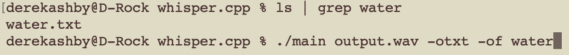

# CS260 course notes (CAN USE ON MIDTERM AND FINAL)

## GitHub Assignment
- I learned how to create and manage a git repository on my machine.
- I also learned how to store that repository on GitHub.
- Finally, I learned how to resolve merge conflicts between local and cloud repositories.

## 1/19/24
- [whisper.wasm](https://github.com/ggerganov/whisper.cpp/tree/master/examples/whisper.wasm)
- [whisper.cpp](https://github.com/ggerganov/whisper.cpp)
### whisper.cpp usage:


## 1/23/24
- learned how to create an AWS EC2 instance
  - public IP http://3.228.72.115
  - ssh -i /Users/derekashby/Documents/starlord-banana-landscaping.pem ubuntu@54.85.249.244

## 1/24/24
- created and set up AWS Route 53 DNS server
  - learned how to connect an IP address to a DNS domain through Route 53
  - "The additional NS and SOA type records that were listed for your domain name are important for working with DNS. These records were created automatically for you when you registered your domain name. The name server (NS) record contains the names of the authoritative name servers that authorize you to place DNS records in this DNS server. Those same authoritative name servers are listed with the registrar that you leased your domain name from. That way the authoritative name server can verify that the DNS records and the DNS registration match and are authorized to represent the domain name when defining DNS records. Otherwise a hacker could just add DNS records and take over your domain name."
  - "This wildcard represents that any subdomain will match this record"

## 2/6/24
### Common HTML elements
| element | meaning                                                                |
| ------- | ---------------------------------------------------------------------- |
| html    | The page container                                                     |
| head    | Header information                                                     |
| title   | Title of the page                                                      |
| meta    | Metadata for the page such as character set or viewport settings       |
| script  | JavaScript reference. Either a external reference, or inline           |
| include | External content reference                                             |
| body    | The entire content body of the page                                    |
| header  | Header of the main content                                             |
| footer  | Footer of the main content                                             |
| nav     | Navigational inputs                                                    |
| main    | Main content of the page                                               |
| section | A section of the main content                                          |
| aside   | Aside content from the main content                                    |
| div     | A block division of content                                            |
| span    | An inline span of content                                              |
| h<1-9>  | Text heading. From h1, the highest level, down to h9, the lowest level |
| p       | A paragraph of text                                                    |
| b       | Bring attention                                                        |
| table   | Table                                                                  |
| tr      | Table row                                                              |
| th      | Table header                                                           |
| td      | Table data                                                             |
| ol,ul   | Ordered or unordered list                                              |
| li      | List item                                                              |
| a       | Anchor the text to a hyperlink                                         |
| img     | Graphical image reference                                              |
| dialog  | Interactive component such as a confirmation                           |
| form    | A collection of user input                                             |
| input   | User input field                                                       |
| audio   | Audio content                                                          |
| video   | Video content                                                          |
| svg     | Scalable vector graphic content                                        |
| iframe  | Inline frame of another HTML page                                      |

### HTML input elements

From the very early days of HTML it contained elements for accepting the input of user data. These elements include the following:

| Element    | Meaning                          | Example                                        |
| ---------- | -------------------------------- | ---------------------------------------------- |
| `form`     | Input container and submission   | `<form action="form.html" method="post">`      |
| `fieldset` | Labeled input grouping           | `<fieldset> ... </fieldset>`                   |
| `input`    | Multiple types of user input     | `<input type="" />`                            |
| `select`   | Selection dropdown               | `<select><option>1</option></select>`          |
| `optgroup` | Grouped selection dropdown       | `<optgroup><option>1</option></optgroup>`      |
| `option`   | Selection option                 | `<option selected>option2</option>`            |
| `textarea` | Multiline text input             | `<textarea></textarea>`                        |
| `label`    | Individual input label           | `<label for="range">Range: </label>`           |
| `output`   | Output of input                  | `<output for="range">0</output>`               |
| `meter`    | Display value with a known range | `<meter min="0" max="100" value="50"></meter>` |

#### Form element

The main purpose of the `form` element is to submit the values of the inputs it contains. Before JavaScript was introduced the `form` container element was essential because it was the only way for the browser to send the input data to a web server as part of a request to process the input and generate a new web page displaying the result of the input. With JavaScript we have much more control over input data and what is done with it. For example, in a single page application the JavaScript will dynamically rebuild the HTML elements to reflect the results of the user interaction. With this ability the data may not even be sent to the server. This greatly reduces the necessity of the `form` element, but it is often still used simply as a container. Just remember that you are not required to have a form element to use input elements.

Here is an example of a simple form that submits the value of a `textarea` element.

```html
<form action="submission.html" method="post">
  <label for="ta">TextArea: </label>
  <textarea id="ta" name="ta-id">
Some text
  </textarea>
  <button type="submit">Submit</button>
</form>
```

Pressing the submit button sends the following data to the web server. The browser generates the data by combining the textarea's `name` attribute with the current value of the textarea.

```
ta-id=Some+text
```

#### Input element

The input element represents many different input types. You set the type of input with the `type` attribute. There are several different types to choose from. This includes different flavors of textual, numeric, date, and color inputs.

| Type           | Meaning                           |
| -------------- | --------------------------------- |
| text           | Single line textual value         |
| password       | Obscured password                 |
| email          | Email address                     |
| tel            | Telephone number                  |
| url            | URL address                       |
| number         | Numerical value                   |
| checkbox       | Inclusive selection               |
| radio          | Exclusive selection               |
| range          | Range limited number              |
| date           | Year, month, day                  |
| datetime-local | Date and time                     |
| month          | Year, month                       |
| week           | Week of year                      |
| color          | Color                             |
| file           | Local file                        |
| submit         | button to trigger form submission |

In order to create an input you specify the desired `type` attribute along with any other attribute associated with that specific input. Here is an example of a checked radio button and its associated label.

```html
<label for="checkbox1">Check me</label> <input type="checkbox" name="varCheckbox" value="checkbox1" checked />
```

Most input elements share some common attributes. These include the following.

| Attribute | Meaning                                                                             |
| --------- | ----------------------------------------------------------------------------------- |
| name      | The name of the input. This is submitted as the name of the input if used in a form |
| disabled  | Disables the ability for the user to interact with the input                        |
| value     | The initial value of the input                                                      |
| required  | Signifies that a value is required in order to be valid                             |

The following shows what the inputs look like when rendered. Don't worry about how clunky they look right out of the box. We will fix that when we start styling things with CSS.


#### Validating input

Several of the input elements have validation built into them. This means that they will not accept a value that is not for example, a number, a URL, outside of a range, or an email address. You can also specify the `required` attribute on an input element to mark it as requiring a value before it can be submitted. The `pattern` attribute exists on `text`, `search`, `url`, `tel`, `email`, and `password` inputs. When present, the pattern attribute provides a regular expression that must match for the input to be considered as valid.

You should also have validation built into your JavaScript that checks input data to ensure everything is valid before it is submitted. All of the input elements support functions for determining their validation state. Additionally, there are CSS style selectors for visualizing the validity of the input. In order to have a good user experience, it is critical that you provide sufficient user feedback early in the input process. A good design will give feedback as, or before, the user begins to input. A poor design will keep the user guessing as to why the data is not being accepted, or even if it was accepted.

### HTML media elements

The HTML elements that represent media include `img`, `audio`, `video`, `svg`, and `canvas`. The `img`, `audio`, and `video` elements are all simple references to an external file, but `svg` and `canvas` both contain the code to render a visual image that can even be animated.

#### External media

The media tags that reference external media all take a URL as an attribute. The path represented by the URL can either be a relative path or full path. A full path includes the protocol, domain name, and path to the file.

```html
https://images.pexels.com/photos/164170/pexels-photo-164170.jpeg
```

A relative path references a file that is served from the same location as the HTML page rendering the element. You want to make the path as relative as possible so that you can move your code around without having to actually adjust all of the external page references. For example, if your HTML page is located in a directory with a subdirectory named `images` that contains a file named `photo.jpg` you would use a relative path as follows.

```html
images/photo.jpg
```

##### Image

To include an image in your content you use the `img` element and specify the `src` attribute with the URL to the source image.
In order to support accessibility, you should also include an `alt` attribute that describes the image. A full img element would look like the following.

```html

```

##### Audio

To include an audio file in your content you use the `audio` element and specify the `src` attribute with the URL to the source audio file. You can include the `controls` attribute if you want the user to be able to control the audio playback. If you do not display the controls then there is no visual representation of the audio in the rendered page. The `autoplay` attribute starts the audio playing as soon as the audio file is loaded, and the `loop` attribute keeps it playing over and over.

⚠ Note that automatically playing audio is strongly discouraged unless you provide a way for the user to opt-in to that behavior.

```html
<audio controls src="testAudio.mp3"></audio>
```

##### Video

To include a video in your content you use the `video` element and specify the `src` attribute with the URL to the source video. Like the audio element you can include the `controls` or `autoplay` attributes.

⚠ Note that you may need to include the `crossorigin="anonymous"` attribute if you are requesting files from a different domain than the one serving your content.

```html
<video controls width="300" crossorigin="anonymous">
  <source src="https://commondatastorage.googleapis.com/gtv-videos-bucket/sample/BigBuckBunny.mp4" />
</video>
```

#### Internal media

The internal media elements `svg` and `canvas` allow you to actually create images directly within your HTML.

##### Scalable Vector Graphics (SVG)

SVG is an extremely powerful and widely supported way to render graphics inline in your HTML. An example SVG graphic that draws a black border and a red circle looks like this:

```html
<svg viewBox="0 0 300 200" xmlns="http://www.w3.org/2000/svg" stroke="red" fill="red" style="border: 1px solid #000000">
  <circle cx="150" cy="100" r="50" />
</svg>
```

When combined with JavaScript and CSS you can produce some amazing visualizations. Checkout this [CodePen](https://codepen.io/leesjensen/pen/mdKjMLY) for an example.

##### Canvas

The `canvas` element was introduced to HTML in order to facilitate 2D drawing and animation. The HTML for the canvas element is fairly simple, but actually drawing on the canvas requires JavaScript support. Here again, is our simple red dot example.

```html
<canvas id="canvasDemo" width="300" height="200" style="border: 1px solid #000000"></canvas>
<script>
  const ctx = document.getElementById('canvasDemo').getContext('2d');
  ctx.beginPath();
  ctx.arc(150, 100, 50, 0, 2 * Math.PI);
  ctx.fillStyle = 'red';
  ctx.strokeStyle = 'red';
  ctx.fill();
  ctx.stroke();
</script>
```

## 2/13/24
### CSS Selectors

The first step in understanding CSS is mastering how to select the elements that a CSS rule applies to. The CSS rule selector can take many forms. In order to explain the most common selectors we need some demonstration HTML. Let's image a simple document describing the departments in a university. In our case we have a physics and a chemistry department. The information provided is very sparse, but the structure provided by the HTML is enough to work with.

```html
<body>
  <h1>Departments</h1>
  <p>welcome message</p>
  <section id="physics">
    <h2>Physics</h2>
    <p class="introduction">Introduction</p>
    <p>Text</p>
    <p class="summary">Summary</p>
  </section>
  <section id="chemistry">
    <h2>Chemistry</h2>
    <p class="introduction">Introduction</p>
    <p>Text</p>
    <p class="summary">Summary</p>
  </section>
</body>
```

#### Element type selector

To start things off, we want to make all elements in the document use a sans-serif font. We can do this by using an element name selector. By selecting the `body` element we will cascade our declaration down to all the children of the body, which is the whole document.

```css
body {
  font-family: sans-serif;
}
```

Note that we could also use the wildcard element name selector (`*`) to select all elements, but for our needs the `body` element will work just fine.

We can also use element name selectors to give a bottom border to the top level heading (`h1`), as well as modify the section elements to pop out with a gray background and some white space in the padding and margins.

```css
h1 {
  border-bottom: thin black solid;
}

section {
  background: #eeeeee;
  padding: 0.25em;
  margin-bottom: 0.5em;
}
```

#### Combinators

Next we want to change the color of the second level headings (`h2`), but we only want to do that within the sections for each department. To make that happen we can provide a `descendant combinator` that is defined with a space delimited list of values where each item in the list is a descendant of the previous item. So our selector would be all `h2` elements that are descendants of `section` elements.

```css
section h2 {
  color: #004400;
}
```

There are other types of combinators that you can use. These include the following.

| Combinator       | Meaning                    | Example        | Description                                |
| ---------------- | -------------------------- | -------------- | ------------------------------------------ |
| Descendant       | A list of descendants      | `body section` | Any section that is a descendant of a body |
| Child            | A list of direct children  | `section > p`  | Any p that is a direct child of a section  |
| General sibling  | A list of siblings         | `div ~ p`      | Any p that has a div sibling               |
| Adjacent sibling | A list of adjacent sibling | `div + p`      | Any p that has an adjacent div sibling     |

We can use the general sibling combinator to increase the whitespace padding on the left of paragraphs that are siblings of a level two heading.

```css
h2 ~ p {
  padding-left: 0.5em;
}
```

#### Class selector

The next selector we will use is the class selector. Remember that any element can have zero or more classifications applied to it. For example, our document has a class of `introduction` applied to the first paragraph, and a class of `summary` applied to the final paragraph of each section. If we want to bold the summary paragraphs we would supply the class name summary prefixed with a period (`.summary`).

```css
.summary {
  font-weight: bold;
}
```

You can also combine the element name and class selectors to select all paragraphs with a class of summary.

```css
p.summary {
  font-weight: bold;
}
```

#### ID selector

ID selectors reference the ID of an element. All IDs should be unique within an HTML document and so this select targets a specific element. To use the ID selector you prefix the ID with the hash symbol (`#`). We would like to showcase our physics department by putting a thin purple border along the left side of the physics section.

```css
#physics {
  border-left: solid 1em purple;
}
```

#### Attribute selector

Attribute selectors allow you to select elements based upon their attributes. You use an attribute selector to select any element with a given attribute (`a[href]`). You can also specify a required value for an attribute (`a[href="./fish.png"]`) in order for the selector to match. Attribute selectors also support wildcards such as the ability to select attribute values containing specific text (`p[href*="https://"]`).

```css
p[class='summary'] {
  color: red;
}
```

For a full description of attribute selections refer to [MDN](https://developer.mozilla.org/en-US/docs/Web/CSS/Attribute_selectors).

#### Pseudo selector

CSS also defines a significant list of pseudo selectors which select based on positional relationships, mouse interactions, hyperlink visitation states, and attributes. We will give just one example. Suppose we want our purple highlight bar to appear only when the mouse hovers over the text. To accomplish this we can change our ID selector to select whenever a section is hovered over.

```css
section:hover {
  border-left: solid 1em purple;
}
```

You can find out more about pseudo selectors on [MDN](https://developer.mozilla.org/en-US/docs/Web/CSS/Pseudo-classes).

### CSS Declarations

CSS rule declarations specify a property and value to assign when the rule selector matches one or more elements. There are legions of possible properties defined for modifying the style of an HTML document. For our purposes we will discuss just a few of the more commonly used ones so that you can get a feel for wide variety of functionality they represent.

| Property           | Value                              | Example             | Discussion                                                                     |
| ------------------ | ---------------------------------- | ------------------- | ------------------------------------------------------------------------------ |
| background-color   | color                              | `red`               | Fill the background color                                                      |
| border             | color width style                  | `#fad solid medium` | Sets the border using shorthand where any or all of the values may be provided |
| border-radius      | unit                               | `50%`               | The size of the border radius                                                  |
| box-shadow         | x-offset y-offset blu-radius color | `2px 2px 2px gray`  | Creates a shadow                                                               |
| columns            | number                             | `3`                 | Number of textual columns                                                      |
| column-rule        | color width style                  | `solid thin black`  | Sets the border used between columns using border shorthand                    |
| color              | color                              | `rgb(128, 0, 0)`    | Sets the text color                                                            |
| cursor             | type                               | `grab`              | Sets the cursor to display when hovering over the element                      |
| display            | type                               | `none`              | Defines how to display the element and its children                            |
| filter             | filter-function                    | `grayscale(30%)`    | Applies a visual filter                                                        |
| float              | direction                          | `right`             | Places the element to the left or right in the flow                            |
| flex               |                                    |                     | Flex layout. Used for responsive design                                        |
| font               | family size style                  | `Arial 1.2em bold`  | Defines the text font using shorthand                                          |
| grid               |                                    |                     | Grid layout. Used for responsive design                                        |
| height             | unit                               | `.25em`             | Sets the height of the box                                                     |
| margin             | unit                               | `5px 5px 0 0`       | Sets the margin spacing                                                        |
| max-[width/height] | unit                               | `20%`               | Restricts the width or height to no more than the unit                         |
| min-[width/height] | unit                               | `10vh`              | Restricts the width or height to no less than the unit                         |
| opacity            | number                             | `.9`                | Sets how opaque the element is                                                 |
| overflow           | [visible/hidden/scroll/auto]       | `scroll`            | Defines what happens when the content does not fix in its box                  |
| position           | [static/relative/absolute/sticky]  | `absolute`          | Defines how the element is positioned in the document                          |
| padding            | unit                               | `1em 2em`           | Sets the padding spacing                                                       |
| left               | unit                               | `10rem`             | The horizontal value of a positioned element                                   |
| text-align         | [start/end/center/justify]         | `end`               | Defines how the text is aligned in the element                                 |
| top                | unit                               | `50px`              | The vertical value of a positioned element                                     |
| transform          | transform-function                 | `rotate(0.5turn)`   | Applies a transformation to the element                                        |
| width              | unit                               | `25vmin`            | Sets the width of the box                                                      |
| z-index            | number                             | `100`               | Controls the positioning of the element on the z axis                          |

#### Units

📖 **Deeper dive reading**: [MDN Values and units](https://developer.mozilla.org/en-US/docs/Learn/CSS/Building_blocks/Values_and_units)

You can use a variety of units when defining the size of a CSS property. For example, the width of an element can be defined using absolute units such as the number of pixels (`px`) or inches (`in`). You can also use relative units such as a percentage of the parent element (`50%`), a percentage of a minimum viewport dimension (`25vmin`), or a multiplier of the size of the letter m (`1.5rem`) as defined by the root element.

```css
p {
  width: 25%;
  height: 30vh;
}
```

Here is a list of the most commonly used units. All of the units are prefixed with a number when used as a property value.

| Unit | Description                                                      |
| ---- | ---------------------------------------------------------------- |
| px   | The number of pixels                                             |
| pt   | The number of points (1/72 of an inch)                           |
| in   | The number of inches                                             |
| cm   | The number of centimeters                                        |
| %    | A percentage of the parent element                               |
| em   | A multiplier of the width of the letter `m` in the parent's font |
| rem  | A multiplier of the width of the letter `m` in the root's font   |
| ex   | A multiplier of the height of the element's font                 |
| vw   | A percentage of the viewport's width                             |
| vh   | A percentage of the viewport's height                            |
| vmin | A percentage of the viewport's smaller dimension                 |
| vmax | A percentage of the viewport's larger dimension                  |

#### Color

📖 **Deeper dive reading**: [MDN Applying color](https://developer.mozilla.org/en-US/docs/Web/CSS/CSS_Colors/Applying_color)

CSS defines multiple ways to describe color, ranging from representations familiar to programmers and ones familiar to layout designers and artists.

| Method       | Example                   | Description                                                                                                                                                                                                       |
| ------------ | ------------------------- | ----------------------------------------------------------------------------------------------------------------------------------------------------------------------------------------------------------------- |
| keyword      | `red`                     | A set of predefined colors (e.g. white, cornflowerblue, darkslateblue)                                                                                                                                            |
| RGB hex      | `#00FFAA22` or `#0FA2`    | Red, green, and blue as a hexadecimal number, with an optional alpha opacity                                                                                                                                      |
| RGB function | `rgb(128, 255, 128, 0.5)` | Red, green, and blue as a percentage or number between 0 and 255, with an optional alpha opacity percentage                                                                                                       |
| HSL          | `hsl(180, 30%, 90%, 0.5)` | Hue, saturation, and light, with an optional opacity percentage. Hue is the position on the 365 degree color wheel (red is 0 and 255). Saturation is how gray the color is, and light is how bright the color is. |

### CSS Fonts

Choosing appropriate fonts is a key web application design characteristic. A beautiful modern font will make your application enjoyable to use. Picking a hard to read font, an overused font, or using too many fonts will turn users away.

The CSS `font-family` property defines what fonts should be used. The property value represents an ordered list of fonts. The first font in the list that is available will be used. This ability to select from a list of fonts is important because different operating systems have different default fonts and your first choice may not be available.

#### Font families

There are four major families of fonts: `Serif`, `sans-serif`, `fixed`, and `symbol`. A serif is a small stroke attached to the ends of a character's major strokes. Serif fonts have the extra strokes; sans-serif fonts do not. Fixed fonts characters all are the same size. This is useful for lining up text when doing things like coding or displaying tabular data. Symbol fonts represent non-language characters such as arrows or emojis.

#### Importing fonts

In addition to referencing standard fonts found on the user's computer you can specify a font that you provide with your application. That way your application is guaranteed to always look the same. In order to have the browser load a font you use the `@font-face` rule and provide the font name and source location.

```css
@font-face {
  font-family: 'Quicksand';
  src: url('https://cs260.click/fonts/quicksand.ttf');
}

p {
  font-family: Quicksand;
}
```

If you do not want to host font files on your server, then you can load them from a font provider. For example, Google provides a large selection of [open source fonts](https://fonts.google.com/) that you can use without paying any royalties. The easiest way to use Google fonts is to use a CSS import statement to reference the Google Font Service. This will automatically generate the CSS for importing the font.

```css
@import url('https://fonts.googleapis.com/css2?family=Rubik Microbe&display=swap');

p {
  font-family: 'Rubik Microbe';
}
```

### CSS Animation

📖 **Deeper dive reading**: [MDN Animation](https://developer.mozilla.org/en-US/docs/Web/CSS/CSS_Animations/Using_CSS_animations)

Using CSS to animate your components is an easy way to make your application feel alive and interactive. You create CSS animations using the `animation` properties and defining `keyframes` for what the element should look like at different times in the animation. Let's walk through an example.

We have a paragraph of centered text and we want it to zoom in until its size is 20% of the view height.

```css
p {
  text-align: center;
  font-size: 20vh;
}
```

To make this happen we specify that we are animating the selected elements by adding the `animation-name` property with a value of demo. This name refers to the name of the `keyframes` that we will specify in a minute. The keyframes tell what CSS properites should be applied at different key points in the animation sequence. We also add an `animation-duration` property in order to specify that the animation should last for three seconds.

```css
p {
  text-align: center;
  font-size: 20vh;

  animation-name: demo;
  animation-duration: 3s;
}
```

Now we are ready to create the keyframes. We don't have to define what happens at every millisecond of the animation. Instead we only need to define the key points, and CSS will generate a smooth transition to move from one keyframe to another. In our case we simply want to start with text that is invisible and have it zoom into the full final size. We can do this with two frames that are designated with the keywords `from` and `to`.

```css
@keyframes demo {
  from {
    font-size: 0vh;
  }

  to {
    font-size: 20vh;
  }
}
```

That's everything we need to do. However, let's make one more addition. It would look better if towards the end, the paragraph bounced out a little bigger than its final size. We can accommodate that by adding another key frame that happens 95 percent through the animation.

```css
@keyframes demo {
  from {
    font-size: 0vh;
  }

  95% {
    font-size: 21vh;
  }

  to {
    font-size: 20vh;
  }
}
```

#### Core Animation Properties
| Property                    | Description                                                                                        |
| --------------------------- | -------------------------------------------------------------------------------------------------- |
| `animation-name`            | Gives the animation a name to reference it w                                                       |
| `animation-duration`        | How long the animation cycle lasts (e.g., 3s for 3 seconds)                                        |
| `animation-timing-function` | Controls the speed curve (e.g., ease-out, linear, cubic-bezier() for custom curves)                |
| `animation-delay`           | A delay before the animation begins (e.g., 2s)                                                     |
| `animation-iteration-count` | How many times the animation repeats (e.g., 3, infinite)                                           |
| `animation-direction`       | Whether the animation alternates directions (e.g., reverse, alternate)                             |
| `animation-fill-mode`       | What styles are applied outside of the animation's duration (e.g., forwards to keep the end state) |
 
#### The `@keyframes` Rule
You define the actual change in styles at different points in the animation using `@keyframes`:

``` CSS
@keyframes slideIn {
    0% { opacity: 0; transform: translateX(-100px); }
    100% { opacity: 1; transform: translateX(0); } 
} 
``` 

#### Example: Applying to an Element

``` CSS
.my-element {
  animation-name: slideIn;
  animation-duration: 1s;
  animation-timing-function: ease-out;
}
```

#### Combine all the values into one property:

```CSS
.my-element {
  animation: slideIn 1s ease-out; 
}
```

## 2/19/24
### CSS Grid

📖 **Deeper dive reading**:

- [MDN Grid](https://developer.mozilla.org/en-US/docs/Web/CSS/CSS_Grid_Layout/Basic_Concepts_of_Grid_Layout)
- [Grid by example](https://gridbyexample.com/)

The `grid` display layout is useful when you want to display a group of child elements in a responsive grid. We start with a container element that has a bunch of child elements.

```html
<div class="container">
  <div class="card"></div>
  <div class="card"></div>
  <div class="card"></div>
  <div class="card"></div>
  <div class="card"></div>
  <div class="card"></div>
  <div class="card"></div>
  <div class="card"></div>
  <div class="card"></div>
</div>
```

We turn this into a responsive grid by including a CSS `display` property with the value of `grid` on the container element. This tells the browser that all of the children of this element are to be displayed in a grid flow. The `grid-template-columns` property specifies the layout of the grid columns. We set this to repeatedly define each column to auto-fill the parent element's width with children that are resized to a minimum of 300 pixels and a maximum of one equal fractional unit (`1fr`) of the parents total width. A fractional unit is dynamically computed by splitting up the parent element's width into equal parts. Next, we fix the height of the rows to be exactly 300 pixels by specifying the `gird-auto-rows` property. Finally, we finish off the grid configuration by setting the `grid-gap` property to have a gap of at least 1 em between each grid item.

```css
.container {
  display: grid;
  grid-template-columns: repeat(auto-fill, minmax(300px, 1fr));
  grid-auto-rows: 300px;
  grid-gap: 1em;
}
```

Here is what the finished product looks like.


You can experiment with the source on [CodePen](https://codepen.io/leesjensen/pen/GRGXoWP).

### Responsive design

📖 **Deeper dive reading**: [MDN Responsive design](https://developer.mozilla.org/en-US/docs/Learn/CSS/CSS_layout/Responsive_Design)

Modern web applications are expected to run well on a large variety of computing devices. This includes everything from desktops, to mobile phones, to shopping kiosks, to car dashboards. This ability to reconfigure the interface so the application accommodates and takes advantage of the screen's size and orientation is called `responsive design`.

Much of HTML and CSS is already fluid due to the fact that it responds to the browser window being resized. For example a paragraph element will resize when the browser window is resized. However, the following features can completely change the layout of the application based on the device's size and orientation.

#### Display

📖 **Deeper dive reading**: [MDN Display](https://developer.mozilla.org/en-US/docs/Web/CSS/display)

The CSS display property allows you to change how an HTML element is displayed by the browser. The common options for the display property include the following.

| Value  | Meaning                                                                                                                      |
| ------ | ---------------------------------------------------------------------------------------------------------------------------- |
| none   | Don't display this element. The element still exists, but the browser will not render it.                                    |
| block  | Display this element with a width that fills its parent element. A `p` or `div` element has block display by default.        |
| inline | Display this element with a width that is only as big as its content. A `b` or `span` element has inline display by default. |
| flex   | Display this element's children in a flexible orientation.                                                                   |
| grid   | Display this element's children in a grid orientation.                                                                       |

We can demonstrate the different CSS display property values with the following HTML that contains a bunch of `div` elements. By default `div` elements have a display property value of `block`.

```html
<div class="none">None</div>
<div class="block">Block</div>
<div class="inline">Inline1</div>
<div class="inline">Inline2</div>
<div class="flex">
  <div>FlexA</div>
  <div>FlexB</div>
  <div>FlexC</div>
  <div>FlexD</div>
</div>
<div class="grid">
  <div>GridA</div>
  <div>GridB</div>
  <div>GridC</div>
  <div>GridD</div>
</div>
```

With the default of `block` this HTML would render like this.


If we modify the display property associated with each element with the following CSS, then we get a totally different rendering.

```css
.none {
  display: none;
}

.block {
  display: block;
}

.inline {
  display: inline;
}

.flex {
  display: flex;
  flex-direction: row;
}

.grid {
  display: grid;
  grid-template-columns: 1fr 1fr;
}
```


You can experiment with different display property values with this [CodePen](https://codepen.io/leesjensen/pen/RwBOPjv).

#### Viewport meta tag

When smart mobile devices started gaining popularity they began to be used to view websites. However, the websites were optimized for desktop displays and not little tiny mobile screens. To solve this mobile browsers automatically started scaling the website so that it looked better on a small screen. Unfortunately, as web applications started being responsive to the screen size, the mobile browser's scaling got in the way. The solution is to include a meta tag in the `head` element of all your HTML pages. This tells the browser to not scale the page.

```html
<meta name="viewport" content="width=device-width,initial-scale=1" />
```

#### Float

The float css property moves an element to the left or right of its container element and allows inline elements to wrap around it. For example, if we had an `aside` element followed by a large paragraph of text, we could create the following CSS rule in order to cause the text to wrap around the aside.

```css
aside {
  float: right;
  padding: 3em;
  margin: 0.5em;
  border: black solid thin;
}
```


When the browser resizes, the text will flow around the floating element. You can use this [CodePen](https://codepen.io/leesjensen/pen/MWBRWPP) to experiment with `float`. Try changing the descriptor value to `none` or `left` and see what happens.

#### Media queries

One of the main CSS features for creating responsive applications is the `@media` selector. This selector dynamically detects the size and orientation of the device and applies CSS rules to represent the structure of the HTML in a way that accommodates the change.

We can use the `@media` selector to tell us which side of the screen (technically the viewport) is the longest. A media query takes one or more predicates separated by boolean operators. In our case we simply want to know if the screen is oriented in portrait mode (short side on top) or not. If it is then we transform all of our div elements by rotating them 270 degrees.

```css
@media (orientation: portrait) {
  div {
    transform: rotate(270deg);
  }
}
```

We can demonstrate the result of applying the media selector by using the browser's debugger and switching into phone and responsive mode. You can also use this [CodePen](https://codepen.io/leesjensen/pen/rNKZOva) and play with it yourself by simply resizing the browser's window.


You can also use media queries to make entire pieces of your application disappear, or move to a different location. For example, if we had an aside that was helpful when the screen is wide, but took up too much room when the screen got narrow, we could use the following media query to make it disappear.

```css
@media (orientation: portrait) {
  aside {
    display: none;
  }
}
```


Here is the [CodePen](https://codepen.io/leesjensen/pen/NWzLGmJ) for this example.

#### Grid and Flexbox

The final two responsive technologies that we want to discuss are Grid and Flexbox. These are both CSS display modes that automatically respond to screen sizes to position and resize their child elements. We will discuss each of these in detail in the following instruction.

## 2/20/24
### JavaScript console

📖 **Deeper dive reading**: [MDN JavaScript Console](https://developer.mozilla.org/en-US/docs/Web/API/console)

The JavaScript console object provides interaction with the JavaScript runtime's debugger console. This usage of console should not be confused with your operating system's console (AKA terminal or command line). The console object provides functionality for outputting the value of text and objects, running timers, and counting iterations. These are useful debugging tools when you can actually execute your code in an interactive debugger (such as VS Code).

#### Log

The basic usage of the console object is to output a log message.

```js
console.log('hello');
// OUTPUT: hello
```

You can create formatted messages in the log parameter.

```js
console.log('hello %s', 'world');
// OUTPUT: hello world
```

You can even specify CSS declarations in order to style the log output.

```js
console.log('%c JavaScript Demo', 'font-size:1.5em; color:green;');
// OUTPUT: JavaScript Demo //in large green text
```

#### Timers

If you are trying to see how long a piece of code is running you can wrap it with `time` and `timeEnd` calls and it will output the duration between the `time` and `timeEnd` calls.

```js
console.time('demo time');
// ... some code that takes a long time.
console.timeEnd('demo time');
// OUTPUT: demo time: 9762.74 ms
```

#### Count

To see how many times a block of code is called you can use the `count` function.

```js
console.count('a');
// OUTPUT: a: 1
console.count('a');
// OUTPUT: a: 2
console.count('b');
// OUTPUT: b: 1
```

### Adding JavaScript to HTML

You can insert JavaScript into HTML either by directly including it in the HTML within the content of a `<script>` element, or by using the `src` attribute of the script element to reference an external JavaScript file.

**index.js**

```js
function sayHello() {
  console.log('hello');
}
```

**index.html**

```html
<head>
  <script src="javascript.js"></script>
</head>
<body>
  <button onclick="sayHello()">Say Hello</button>
  <button onclick="sayGoodbye()">Say Goodbye</button>
  <script>
    function sayGoodbye() {
      alert('Goodbye');
    }
  </script>
</body>
```

Notice that we call the `sayHello` and `sayGoodbye` JavaScript functions from the HTML in the `onclick` attribute of the button element. Special attributes like `onclick` automatically create event listeners for different DOM events that call the code contained in the attribute's value. The code specified by the attribute value can be a simple call to a function or any JavaScript code.

```html
<button onclick="let i=1;i++;console.log(i)">press me</button>
<!-- OUTPUT: 2 -->
```

### JavaScript type and construct

📖 **Deeper dive reading**: [MDN Data types and structures](https://developer.mozilla.org/en-US/docs/Web/JavaScript/Data_structures)

####Declaring variables

Variables are declared using either the `let` or `const` keyword. `let` allows you to change the value of the variable while `const` will cause an error if you attempt to change it.

```js
let x = 1;

const y = 2;
```

⚠ Originally JavaScript used the keyword `var` to define variables. This has been deprecated because they cause hard-to-detect errors in code related to the scope of the variable. You should avoid `var` and always declare your variables either with `let` or `const`.

#### Type

JavaScript defines several primitive types.

| Type        | Meaning                                                    |
| ----------- | ---------------------------------------------------------- |
| `Null`      | The type of a variable that has not been assigned a value. |
| `Undefined` | The type of a variable that has not been defined.          |
| `Boolean`   | true or false.                                             |
| `Number`    | A 64-bit signed number.                                    |
| `BigInt`    | A number of arbitrary magnitude.                           |
| `String`    | A textual sequence of characters.                          |
| `Symbol`    | A unique value.                                            |

Of these types Boolean, Number, and String are the types commonly thought of when creating variables. However, variables may commonly refer to the Null or Undefined primitive. Because JavaScript does not enforce the declaration of a variable before you use it, it is entirely possible for a variable to have the type of Undefined.

In addition to the above primitives, JavaScript defines several object types. Some of the more commonly used objects include the following:

| Type       | Use                                                                                    | Example                  |
| ---------- | -------------------------------------------------------------------------------------- | ------------------------ |
| `Object`   | A collection of properties represented by name-value pairs. Values can be of any type. | `{a:3, b:'fish'}`        |
| `Function` | An object that has the ability to be called.                                           | `function a() {}`        |
| `Date`     | Calendar dates and times.                                                              | `new Date('1995-12-17')` |
| `Array`    | An ordered sequence of any type.                                                       | `[3, 'fish']`            |
| `Map`      | A collection of key-value pairs that support efficient lookups.                        | `new Map()`              |
| `JSON`     | A lightweight data-interchange format used to share information across programs.       | `{"a":3, "b":"fish"}`    |

#### Common operators

When dealing with a number variable, JavaScript supports standard mathematical operators like `+` (add), `-` (subtract), `*` (multiply), `/` (divide), and `===` (equality). For string variables, JavaScript supports `+` (concatenation) and `===` (equality).

#### Type conversions

JavaScript is a weakly typed language. That means that a variable always has a type, but the variable can change type when it is assigned a new value, or that types can be automatically converted based upon the context that they are used in. Sometimes the results of automatic conversions can be unexpected from programmers who are used to strongly typed languages. Consider the following examples.

```js
2 + '3';
// OUTPUT: '23'
2 * '3';
// OUTPUT: 6
[2] + [3];
// OUTPUT: '23'
true + null;
// OUTPUT: 1
true + undefined;
// OUTPUT: NaN
```

Getting unexpected results is especially common when dealing with the [equality](https://developer.mozilla.org/en-US/docs/Web/JavaScript/Equality_comparisons_and_sameness) operator.

```js
1 == '1';
// OUTPUT: true
null == undefined;
// OUTPUT: true
'' == false;
// OUTPUT: true
```

⚠ The unexpected results happen in JavaScript because it uses [complex rules](https://developer.mozilla.org/en-US/docs/Web/JavaScript/Equality_comparisons_and_sameness#strict_equality_using) for defining equality that depend upon the conversion of a type to a boolean value. You will sometimes hear this referred to as [falsy](https://developer.mozilla.org/en-US/docs/Glossary/Falsy) and [truthy](https://developer.mozilla.org/en-US/docs/Glossary/Truthy) evaluations. To remove this confusion, JavaScript introduced the strict equality (===) and inequality (!==) operators. The strict operators skip the type conversion when computing equality. This results in the following.

```js
1 === '1';
// OUTPUT: false
null === undefined;
// OUTPUT: false
'' === false;
// OUTPUT: false
```

Because strict equality is considered more intuitive, it is almost always preferred and should be used in your code.

Here is a fun example of JavaScript's type conversion. Execute the following in the browser's debugger console.

```js
('b' + 'a' + +'a' + 'a').toLowerCase();
```

#### Conditionals

JavaScript supports many common programming language conditional constructs. This includes `if`, `else`, and `if else`. Here are some examples.

```js
if (a === 1) {
  //...
} else if (b === 2) {
  //...
} else {
  //...
}
```

You can also use the ternary operator. This provides a compact `if else` representation.

```js
a === 1 ? console.log(1) : console.log('not 1');
```

You can use boolean operations in the expression to create complex predicates. Common boolean operators include `&&` (and), `||` (or), and `!` (not).

```js
if (true && (!false || true)) {
  //...
}
```

#### Loops

JavaScript supports many common programming language looping constructs. This includes `for`, `for in`, `for of`, `while`, `do while`, and `switch`. Here are some examples.

##### for

Note the introduction of the common post increment operation (`i++`) for adding one to a number.

```js
for (let i = 0; i < 2; i++) {
  console.log(i);
}
// OUTPUT: 0 1
```

##### do while

```js
let i = 0;
do {
  console.log(i);
  i++;
} while (i < 2);
// OUTPUT: 0 1
```

##### while

```js
let i = 0;
while (i < 2) {
  console.log(i);
  i++;
}
// OUTPUT: 0 1
```

##### for in

The `for in` statement iterates over an object's property names.

```js
const obj = { a: 1, b: 'fish' };
for (const name in obj) {
  console.log(name);
}
// OUTPUT: a
// OUTPUT: b
```

For arrays the object's name is the array index.

```js
const arr = ['a', 'b'];
for (const name in arr) {
  console.log(name);
}
// OUTPUT: 0
// OUTPUT: 1
```

##### for of

The `for of` statement iterates over an iterable's (Array, Map, Set, ...) property values.

```js
const arr = ['a', 'b'];
for (const val of arr) {
  console.log(val);
}
// OUTPUT: 'a'
// OUTPUT: 'b'
```

##### Break and continue

All of the looping constructs demonstrated above allow for either a `break` or `continue` statement to abort or advance the loop.

```js
let i = 0;
while (true) {
  console.log(i);
  if (i === 0) {
    i++;
    continue;
  } else {
    break;
  }
}
// OUTPUT: 0 1
```

### JavaScript string

📖 **Deeper dive reading**: [MDN String](https://developer.mozilla.org/en-US/docs/Web/JavaScript/Reference/Global_Objects/String)

Strings are a primitive type in JavaScript. A string variable is specified by surrounding a sequence of characters with single quotes (`'`), double quotes (`"`), or backticks (`` ` ``). The meaning of single or double quotes are equivalent, but the backtick defines a string literal that may contain JavaScript that is evaluated in place and concatenated into the string. A string literal replacement specifier is declared with a dollar sign followed by a curly brace pair. Anything inside the curly braces is evaluated as JavaScript. You can also use backticks to create multiline strings without having to explicitly escape the newline characters using `\n`.

```js
'quoted text'; // " also works

const l = 'literal';
console.log(`string ${l + (1 + 1)} text`);
// OUTPUT: string literal2 text
```

#### Unicode support

JavaScript supports Unicode by defining a string as a 16-bit unsigned integer that represents UTF-16 strings. Unicode support allows JavaScript to represent most languages spoken on the planet. This includes those that are read from right to left.

> حجر
>
> أقول لهذا الحجر: أنا أنت. فيقول: لستَ مرناً الى هذا الحدّ. أقول: قلبي مثلك؟ فيقول:

However, there are several important steps you must take in order to make your web application fully internationalized. This includes handling of currency, time, dates, iconography, units of measure, keyboard layouts, and respecting local customs. Read this [article on the W3C website](https://www.w3.org/standards/webdesign/i18n) to learn more about internationalization.

#### String functions

The string object has several interesting functions associated with it. Here are some of the commonly used ones.

| Function      | Meaning                                                      |
| ------------- | ------------------------------------------------------------ |
| length        | The number of characters in the string                       |
| indexOf()     | The starting index of a given substring                      |
| split()       | Split the string into an array on the given delimiter string |
| startsWith()  | True if the string has a given prefix                        |
| endsWith()    | True if the string has a given suffix                        |
| toLowerCase() | Converts all characters to lowercase                         |

```js
const s = 'Example:조선글';

console.log(s.length);
// OUTPUT: 11
console.log(s.indexOf('조선글'));
// OUTPUT: 8
console.log(s.split(':'));
// OUTPUT: ['Example', '조선글']
console.log(s.startsWith('Ex'));
// OUTPUT: true
console.log(s.endsWith('조선글'));
// OUTPUT: true
console.log(s.toLowerCase());
// OUTPUT: example:조선글
```

### Functions

📖 **Deeper dive reading**: [MDN Functions](https://developer.mozilla.org/en-US/docs/Web/JavaScript/Reference/Functions)

In JavaScript functions are first class objects. That means that they can be assigned a name, passed as a parameter, returned as a result, and referenced from an object or array just like any other variable.

The basic syntax of a function begins with the `function` keyword followed by zero or more parameters and a body that may contain zero or more return statements. The return statement may return a single value. Note that there are no type declarations, as the type is always inferred by the assignment of the value to the parameter.

```js
function hello(who) {
  return 'hello ' + who;
}

console.log(hello('world'));
// OUTPUT: hello world
```

A function without a return value usually exists to produce some side effect like modifying a parameter or interacting with an external program. In the following example the side effect of the function is to output text to the debugger console.

```js
function hello(who) {
  who.count++;
  console.log('hello ' + who.name);
}

hello({ name: 'world', count: 0 });
// OUTPUT: hello world
```

#### Function parameters

When a function is called, the caller may choose what parameters to provide. If a parameter is not provided then the value of the parameter is `undefined` when the function executes.

In addition to explicitly passing the value of a parameter to a function, the function can define a default value. This is done by assigning a value to the parameter in the function declaration.

```js
function labeler(value, title = 'title') {
  console.log(`${title}=${value}`);
}

labeler();
// OUTPUT: title=undefined

labeler('fish');
// OUTPUT: title=fish

labeler('fish', 'animal');
// OUTPUT: animal=fish
```

#### Anonymous functions

Functions in JavaScript are commonly assigned to a variable so that they can be passed as a parameter to some other function or stored as an object property. To easily support this common use you can define a function anonymously and assign it to a variable.

```js
// Function that takes a function as a parameter
function doMath(operation, a, b) {
  return operation(a, b);
}

// Anonymous function assigned to a variable
const add = function (a, b) {
  return a + b;
};

console.log(doMath(add, 5, 3));
// OUTPUT: 8

// Anonymous function assigned to a parameter
console.log(
  doMath(
    function (a, b) {
      return a - b;
    },
    5,
    3
  )
);
// OUTPUT: 2
```

#### Creating, passing, and returning functions

Here are examples of assigning functions to variables, as well as using functions as parameters and return values.

```js
// Anonymous declaration of the function that is later assigned to a variable
const add = function (a, b) {
  return a + b;
};

// Function that logs as a side effect of its execution
function labeler(label, value) {
  console.log(label + '=' + value);
}

// Function that takes a function as a parameter and then executes the function as a side effect
function addAndLabel(labeler, label, adder, a, b) {
  labeler(label, adder(a, b));
}

// Passing a function to a function
addAndLabel(labeler, 'a+b', add, 1, 3);
// OUTPUT: a+b=4

// Function that returns a function
function labelMaker(label) {
  return function (value) {
    console.log(label + '=' + value);
  };
}

// Assign a function from the return value of the function
const nameLabeler = labelMaker('name');

// Calling the returned function
nameLabeler('value');
// OUTPUT: name=value
```

#### Inner functions

Functions can also be declared inside other functions. This allows you to modularize your code without always exposing private details.

```js
function labeler(value) {
  function stringLabeler(value) {
    console.log('string=' + value);
  }
  function numberLabeler(value) {
    console.log('number=' + value);
  }

  if (typeof value == 'string') {
    stringLabeler(value);
  } else if (typeof value == 'number') {
    numberLabeler(value);
  }
}

labeler(5);
// OUTPUT: number=5

labeler('fish');
// OUTPUT: string=fish
```


### JavaScript arrow function

Because functions are first order objects in JavaScript they can be declared anywhere and passed as parameters. This results in code with lots of anonymous functions cluttering things up. To make the code more compact the `arrow` syntax was created. This syntax replaces the need for the `function` keyword with the symbols `=>` placed after the parameter declaration. The enclosing curly braces are also optional.

This is a function in arrow syntax that takes no parameters and always returns 3.

```js
() => 3;
```

The following two invocations of sort are equivalent.

```js
const a = [1, 2, 3, 4];

// standard function syntax
a.sort(function (v1, v2) {
  return v1 - v2;
});

// arrow function syntax
a.sort((v1, v2) => v1 - v2);
```

Besides being compact, the `arrow` function syntax has some important semantic differences from the standard function syntax. This includes restrictions that arrow functions cannot be used for constructors or iterator generators.

#### Return values

Arrow functions also have special rules for the `return` keyword. The return keyword is optional if no curly braces are provided for the function and it contains a single expression. In that case the result of the expression is automatically returned. If curly braces are provided then the arrow function behaves just like a standard function.

```js
() => 3;
// RETURNS: 3

() => {
  3;
};
// RETURNS: undefined

() => {
  return 3;
};
// RETURNS: 3
```

#### This pointer

Next, arrow functions inherit the `this` pointer from the scope of where it is created. This makes what is known as a `closure`. A closure allows a function to continue referencing its creation scope, even after it has passed out of that scope. This can be tricky to wrap your head around, and we discuss it in detail when we later talk about JavaScript `scope`. For now consider the following example.

The function `makeClosure` returns an anonymous function using the arrow syntax. Notice that the `a` parameter is overridden, a new `b` variable is created, and both `a` and `b` are referenced in the arrow function. Because of that reference, they are both part of the closure for the returned function.

```js
function makeClosure(a) {
  a = 'a2';
  const b = 'b2';
  return () => [a, b];
}
```

Next, we declare the variables `a` and `b` at the top level scope, and call `makeClosure` with `a`.

```js
const a = 'a';
const b = 'b';

const closure = makeClosure(a);
```

Now, when we call `closure` function it will output the values contained in scope where it was created instead of the current values of the variables.

```js
console.log(closure());
// OUTPUT: ['a2', 'b2']

console.log(a, b);
// OUTPUT: 'a' 'b'
```

Closures provide a valuable property when we do things like execute JavaScript within the scope of an HTML page, because it can remember the values of variables when the function was created instead of what they are when they are executed.

#### Putting it all together

Now that you know how functions work in JavaScript, let's look at an example that demonstrates the use of functions, arrow functions, parameters, a function as a parameter (callback), closures, and browser event listeners. This is done by implementing a `debounce` function.

The point of a debounce function is to only execute a specified function once within a given time window. Any requests to execute the debounce function more frequently than this will case the time window to reset. This is important in cases where a user can trigger expensive events thousands of times per second. Without a debounce the performance of your application can greatly suffer.

The following code calls the browser's `window.addEventListener` function to add a callback function that is invoked whenever the user scrolls the browser's web page. The first parameter to `addEventListener` specifies that it wants to listen for `scroll` events. The second parameter provides the function to call when a scroll event happens. In this case we call a function named `debounce`.

The debounce function takes two parameters, the time window for executing the window function, and the window function to call within that limit. In this case we will execute the arrow function at most every 500 milliseconds.

```js
window.addEventListener(
  'scroll',
  debounce(500, () => {
    console.log('Executed an expensive calculation');
  })
);
```

The debounce function implements the execution of windowFunc within the restricted time window by creating a closure that contains the current timeout and returning a function that will reset the timeout every time it is called. The returned function is what the scroll event will actually call when the user scrolls the page. However, instead of directly executing the `windowFunc` it sets a timer based on the value of `windowMs`. If the debounce function is called again before the window times out then it resets the timeout.

```js
function debounce(windowMs, windowFunc) {
  let timeout;
  return function () {
    console.log('scroll event');
    clearTimeout(timeout);
    timeout = setTimeout(() => windowFunc(), windowMs);
  };
}
```

You can experiment with this in [CodePen](https://codepen.io/leesjensen/pen/XWxVBRx). In this example, the background color will change as long as the user is scrolling. When they stop the background reverts back to white.

### JavaScript array

📖 **Deeper dive reading**: [MDN Array](https://developer.mozilla.org/en-US/docs/Web/JavaScript/Reference/Global_Objects/Array)

JavaScript array objects represent a sequence of other objects and primitives. You can reference the members of the array using a zero based index. You can create an array with the Array constructor or using the array literal notation shown below.

```js
const a = [1, 2, 3];
console.log(a[1]);
// OUTPUT: 2

console.log(a.length);
// OUTPUT: 3
```

#### Object functions

The Array object has several interesting static functions associated with it. Here are some of the interesting ones.

| Function | Meaning                                                   | Example                       |
| -------- | --------------------------------------------------------- | ----------------------------- |
| push     | Add an item to the end of the array                       | `a.push(4)`                   |
| pop      | Remove an item from the end of the array                  | `x = a.pop()`                 |
| slice    | Return a sub-array                                        | `a.slice(1,-1)`               |
| sort     | Run a function to sort an array in place                  | `a.sort((a,b) => b-a)`        |
| values   | Creates an iterator for use with a `for of` loop          | `for (i of a.values()) {...}` |
| find     | Find the first item satisfied by a test function          | `a.find(i => i < 2)`          |
| forEach  | Run a function on each array item                         | `a.forEach(console.log)`      |
| reduce   | Run a function to reduce each array item to a single item | `a.reduce((a, c) => a + c)`   |
| map      | Run a function to map an array to a new array             | `a.map(i => i+i)`             |
| filter   | Run a function to remove items                            | `a.filter(i => i%2)`          |
| every    | Run a function to test if all items match                 | `a.every(i => i < 3)`         |
| some     | Run a function to test if any items match                 | `a.some(i => 1 < 1)`          |

```js
const a = [1, 2, 3];

console.log(a.map((i) => i + i));
// OUTPUT: [2,4,6]
console.log(a.reduce((v1, v2) => v1 + v2));
// OUTPUT: 6
console.log(a.sort((v1, v2) => v2 - v1));
// OUTPUT: [3,2,1]

a.push(4);
console.log(a.length);
// OUTPUT: 4
```

## 2/22/24
### JSON

📖 **Deeper dive reading**:

- [MDN JSON](https://developer.mozilla.org/en-US/docs/Web/JavaScript/Reference/Global_Objects/JSON)
- [Douglas Crockford: The JSON Saga](https://www.youtube.com/watch?v=-C-JoyNuQJs)

JavaScript Object Notation (JSON) was conceived by Douglas Crockford in 2001 while working at Yahoo! JSON, pronounced like the name Jason, received official standardization in 2013 and 2017 (ECMA-404, [RFC 8259](https://datatracker.ietf.org/doc/html/rfc8259)).

JSON provides a simple, and yet effective way, to share and store data. By design JSON is easily convertible to, and from, JavaScript objects. This make it a very convenient data format when working with web technologies. Because of its simplicity, standardization, and compatibility with JavaScript, JSON has become one of the world's most popular data formats.

#### Format

A JSON document contains one of the following data types:

| Type    | Example                 |
| ------- | ----------------------- |
| string  | "crockford"             |
| number  | 42                      |
| boolean | true                    |
| array   | [null,42,"crockford"]   |
| object  | {"a":1,"b":"crockford"} |
| null    | null                    |

Most commonly, a JSON document contains an object. Objects contain zero or more key value pairs. The key is always a string, and the value must be one of the valid JSON data types. Key value pairs are delimited with commas. Curly braces delimit an object, square brackets and commas delimit arrays, and strings are always delimited with double quotes.

Here is an example of a JSON document.

```json
{
  "class": {
    "title": "web programming",
    "description": "Amazing"
  },
  "enrollment": ["Marco", "Jana", "فَاطِمَة"],
  "start": "2025-02-01",
  "end": null
}
```

JSON is always encoded with [UTF-8](https://en.wikipedia.org/wiki/UTF-8). This allows for the representation of global data.

#### Converting to JavaScript

You can convert JSON to, and from, JavaScript using the `JSON.parse` and `JSON.stringify` functions.

```js
const obj = { a: 2, b: 'crockford', c: undefined };
const json = JSON.stringify(obj);
const objFromJson = JSON.parse(json);

console.log(obj, json, objFromJson);

// OUTPUT:
// {a: 2, b: 'crockford', c: undefined}
// {"a":2, "b":"crockford"}
// {a: 2, b: 'crockford'}
```

Note that in this example, JSON cannot represent the JavaScript `undefined` object and so it gets dropped when converting from JavaScript to JSON.
