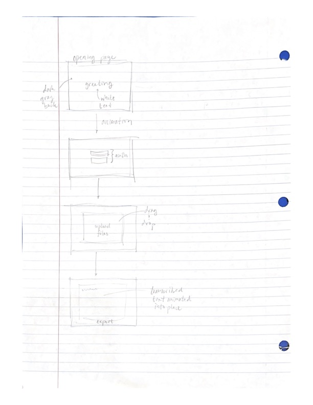

# whisper.txt
[notes.md](notes.md)

## Specification Deliverable
### Elevator Pitch
Transcription is exhausting. Listening -- and re-listening -- to the same audio time after time to accurately put speech to text is a waste of time and money. Simply put, it is a task humans should never need to perform. Hence whisper.txt.
Whisper.txt allows you to focus on what is most important by accurately and effortlessly transcribing any audio file you throw at it. Simply log in, drop your audio, and let whisper.txt do the rest.
Stop transcribing. Start whispering.

### Design

### Key Features
- Secure login over HTTPS
- Audio input and text output are never stored on our servers
- Simple user interface
- Rapid program execution

### Technologies
I will employ these required technologies as follows
- **HTML** - Provides basic framework for login and web app pages.
- **CSS** - Adds styling, animation, and fluid UI.
- **JavaScript** - Enables login, calls Whisper transcription model (written in c++ for speed), provides button interactivity.
- **Service** - Backend service with endpoints for:
  - Authentication
  - Receiving audio input
  - Sending text output
- **DB/Login** - Stores users and credentials in database. 
- **WebSocket** - Provides real-time transcription generation capability
- **React** - Application will be ported to use the React web framework.