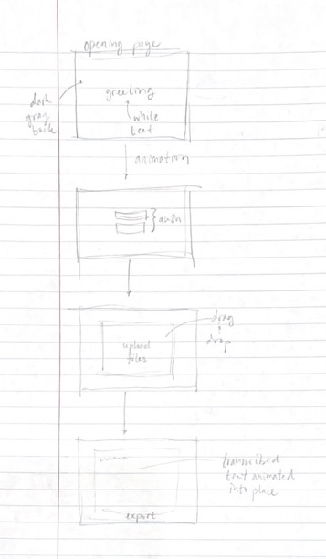

# whisper.txt
[notes.md](notes.md)

## Specification Deliverable
### Elevator Pitch
Transcription is exhausting. Listening -- and re-listening -- to the same audio time after time to accurately put speech to text is a waste of time and money. Simply put, it is a task humans should never need to perform. Hence whisper.txt.
Whisper.txt allows you to focus on what is most important by accurately and effortlessly transcribing any audio file you throw at it. Simply log in, drop your audio, and let whisper.txt do the rest.
Stop transcribing. Start whispering.

### Design

### Key Features
- Secure login over HTTPS
- Audio input and text output are never stored on our servers
- Simple user interface
- Rapid program execution

### Technologies
I will employ these required technologies as follows
- **HTML** - Provides basic framework for login and web app pages.
- **CSS** - Adds styling, animation, and fluid UI.
- **JavaScript** - Enables login, calls Whisper transcription model (written in c++ for speed), provides button interactivity.
- **Service** - Backend service with endpoints for:
  - Authentication
  - Receiving audio input
  - Sending text output
- **DB/Login** - Stores users and credentials in database. 
- **WebSocket** - Provides real-time transcription generation capability
- **React** - Application will be ported to use the React web framework.

## HTML Deliverable
- **HTML pages** - 4 HTML pages: 
  1. a welcome/login screen
  2. a page to upload audio files
  3. a page to display transcribed audio
  4. an information page
- **Links** - the header of every page has links to the login screen and the about page. The transcription page has an additional link to the upload files page
- **Text** - the welcome after login (displays the user's name) and the generated transcription are represented by a textual placeholder
- **Images** - an abstract waveform image occupies the footer of each page
- **DB/Login** - index.html includes fields for the user's name and password. Upon login, their username will be displayed in a welcome message
- **WebSocket** - the placeholder text in transcribe.html represents the realtime generated transcription

## CSS Deliverable
For this deliverable, I properly styled whisper.txt into nearly its final appearance. I will continue to modify the styling as necessary as I add functionality.

- **Header, footer, and main content body**
- **Navigation elements** - I dropped the underlines, changed the color and font weight, and modified hover behavior for anchor elements
- **Responsive to window resizing** - My app looks great on all window sizes and devices
- **Application elements** - All elements are clearly visible and adhere to a cohesive theme
- **Application text content** - I used Google's Noto Sans Mono font across the entire project
- **Application images** - I employed my application image along the page's footer

## JS Deliverable
The JavaScript I wrote for this deliverable makes the site functional for a single user. I used placeholders to signal where future technologies will be applied.

- **Login** - Pressing the login button stores the user's name locally as a placeholder for the database functionality.
- **Database** - The user's name is displayed prominently on each page related to transcription. Additionally, when joining whisper, the user's credentials are stored into a map data structure. This is done locally but will be stored on a database in the future.
- **WebSocket** - I wrote code to display the transcribed text on screen. This is currently accomplished by a placeholder.
- **Application logic** - Most of the text animates as if being typed. Button clicks provide validation and trigger animations.

## Service Deliverable
For this deliverable, I converted my startup to the Express service framework and created the following backend endpoints:
- endpoint for receiving audio files from client
- endpoint for downloading text files to client

- **Node.js/Express HTTP service** - done!
- **Static middleware for frontend** - done!
- **Calls to third party endpoints** - On the transcription page, a fetch call is made to retrieve a random Chuck Norris joke if there is no text to transcribe
- **Backend service endpoints** - Placeholders for login that stores the current user on the server. Endpoints for data transfer.
- **Frontend calls service endpoints** - I accomplished this using fetch calls.

## DB/Login deliverable
MongoDB now stores the user credentials for my service

- **MongoDB Atlas database created** - done!
- **Stores data in MongoDB** - done!
- **User registration** - Creates a new account in the database.
- **Existing user** - Only existing users can log in and use the service. Error messages display if passwords don't match or if the user does not exist when trying to authenticate.
- **Use MongoDB to store credentials** - Stores the user's name, email, and password.
- **Restricts functionality** - Only authenticated users can proceed past the login page. Upload/download endpoints do not function if there is no authentication.

## WebSocket deliverable
With this deliverable, I modified my service so that transcription requests and replies were sent over WebSocket

It doesn't work very quickly, because my server's not super powerful, but THE TRANSCRIPTION WORKS!!! I made sure to delete all user files as soon as the server is finished with them to preserve user privacy

Also, I added an easter egg where a Chuck Norris joke (3rd party endpoint) animates on the screen if the output text is clicked. 

I feel very challenged by, humbled by, and proud of this project.

- **Backend listens for WebSocket connection** - my server listens for requests to transcribe uploaded files
- **Frontend makes WebSocket connection** - the frontend makes a websocket connection when the transcribe page is loaded
- **Data sent over WebSocket connection** - transcribed text is sent over websocket!
- **WebSocket data displayed** - the transcribed text types itself out onto the screen