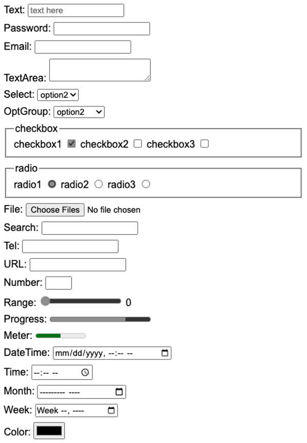

# CS260 course notes (CAN USE ON MIDTERM AND FINAL)

## GitHub Assignment
- I learned how to create and manage a git repository on my machine.
- I also learned how to store that repository on GitHub.
- Finally, I learned how to resolve merge conflicts between local and cloud repositories.

## 1/19/24
- [whisper.wasm](https://github.com/ggerganov/whisper.cpp/tree/master/examples/whisper.wasm)
- [whisper.cpp](https://github.com/ggerganov/whisper.cpp)
### whisper.cpp usage:


## 1/23/24
- learned how to create an AWS EC2 instance
  - public IP http://3.228.72.115
  - ssh -i /Users/derekashby/Documents/starlord-banana-landscaping.pem ubuntu@54.85.249.244

## 1/24/24
- created and set up AWS Route 53 DNS server
  - learned how to connect an IP address to a DNS domain through Route 53
  - "The additional NS and SOA type records that were listed for your domain name are important for working with DNS. These records were created automatically for you when you registered your domain name. The name server (NS) record contains the names of the authoritative name servers that authorize you to place DNS records in this DNS server. Those same authoritative name servers are listed with the registrar that you leased your domain name from. That way the authoritative name server can verify that the DNS records and the DNS registration match and are authorized to represent the domain name when defining DNS records. Otherwise a hacker could just add DNS records and take over your domain name."
  - "This wildcard represents that any subdomain will match this record"

## 2/6/24
### Common HTML elements
| element | meaning                                                                |
| ------- | ---------------------------------------------------------------------- |
| html    | The page container                                                     |
| head    | Header information                                                     |
| title   | Title of the page                                                      |
| meta    | Metadata for the page such as character set or viewport settings       |
| script  | JavaScript reference. Either a external reference, or inline           |
| include | External content reference                                             |
| body    | The entire content body of the page                                    |
| header  | Header of the main content                                             |
| footer  | Footer of the main content                                             |
| nav     | Navigational inputs                                                    |
| main    | Main content of the page                                               |
| section | A section of the main content                                          |
| aside   | Aside content from the main content                                    |
| div     | A block division of content                                            |
| span    | An inline span of content                                              |
| h<1-9>  | Text heading. From h1, the highest level, down to h9, the lowest level |
| p       | A paragraph of text                                                    |
| b       | Bring attention                                                        |
| table   | Table                                                                  |
| tr      | Table row                                                              |
| th      | Table header                                                           |
| td      | Table data                                                             |
| ol,ul   | Ordered or unordered list                                              |
| li      | List item                                                              |
| a       | Anchor the text to a hyperlink                                         |
| img     | Graphical image reference                                              |
| dialog  | Interactive component such as a confirmation                           |
| form    | A collection of user input                                             |
| input   | User input field                                                       |
| audio   | Audio content                                                          |
| video   | Video content                                                          |
| svg     | Scalable vector graphic content                                        |
| iframe  | Inline frame of another HTML page                                      |

### HTML input elements

From the very early days of HTML it contained elements for accepting the input of user data. These elements include the following:

| Element    | Meaning                          | Example                                        |
| ---------- | -------------------------------- | ---------------------------------------------- |
| `form`     | Input container and submission   | `<form action="form.html" method="post">`      |
| `fieldset` | Labeled input grouping           | `<fieldset> ... </fieldset>`                   |
| `input`    | Multiple types of user input     | `<input type="" />`                            |
| `select`   | Selection dropdown               | `<select><option>1</option></select>`          |
| `optgroup` | Grouped selection dropdown       | `<optgroup><option>1</option></optgroup>`      |
| `option`   | Selection option                 | `<option selected>option2</option>`            |
| `textarea` | Multiline text input             | `<textarea></textarea>`                        |
| `label`    | Individual input label           | `<label for="range">Range: </label>`           |
| `output`   | Output of input                  | `<output for="range">0</output>`               |
| `meter`    | Display value with a known range | `<meter min="0" max="100" value="50"></meter>` |

#### Form element

The main purpose of the `form` element is to submit the values of the inputs it contains. Before JavaScript was introduced the `form` container element was essential because it was the only way for the browser to send the input data to a web server as part of a request to process the input and generate a new web page displaying the result of the input. With JavaScript we have much more control over input data and what is done with it. For example, in a single page application the JavaScript will dynamically rebuild the HTML elements to reflect the results of the user interaction. With this ability the data may not even be sent to the server. This greatly reduces the necessity of the `form` element, but it is often still used simply as a container. Just remember that you are not required to have a form element to use input elements.

Here is an example of a simple form that submits the value of a `textarea` element.

```html
<form action="submission.html" method="post">
  <label for="ta">TextArea: </label>
  <textarea id="ta" name="ta-id">
Some text
  </textarea>
  <button type="submit">Submit</button>
</form>
```

Pressing the submit button sends the following data to the web server. The browser generates the data by combining the textarea's `name` attribute with the current value of the textarea.

```
ta-id=Some+text
```

#### Input element

The input element represents many different input types. You set the type of input with the `type` attribute. There are several different types to choose from. This includes different flavors of textual, numeric, date, and color inputs.

| Type           | Meaning                           |
| -------------- | --------------------------------- |
| text           | Single line textual value         |
| password       | Obscured password                 |
| email          | Email address                     |
| tel            | Telephone number                  |
| url            | URL address                       |
| number         | Numerical value                   |
| checkbox       | Inclusive selection               |
| radio          | Exclusive selection               |
| range          | Range limited number              |
| date           | Year, month, day                  |
| datetime-local | Date and time                     |
| month          | Year, month                       |
| week           | Week of year                      |
| color          | Color                             |
| file           | Local file                        |
| submit         | button to trigger form submission |

In order to create an input you specify the desired `type` attribute along with any other attribute associated with that specific input. Here is an example of a checked radio button and its associated label.

```html
<label for="checkbox1">Check me</label> <input type="checkbox" name="varCheckbox" value="checkbox1" checked />
```

Most input elements share some common attributes. These include the following.

| Attribute | Meaning                                                                             |
| --------- | ----------------------------------------------------------------------------------- |
| name      | The name of the input. This is submitted as the name of the input if used in a form |
| disabled  | Disables the ability for the user to interact with the input                        |
| value     | The initial value of the input                                                      |
| required  | Signifies that a value is required in order to be valid                             |

The following shows what the inputs look like when rendered. Don't worry about how clunky they look right out of the box. We will fix that when we start styling things with CSS.



#### Validating input

Several of the input elements have validation built into them. This means that they will not accept a value that is not for example, a number, a URL, outside of a range, or an email address. You can also specify the `required` attribute on an input element to mark it as requiring a value before it can be submitted. The `pattern` attribute exists on `text`, `search`, `url`, `tel`, `email`, and `password` inputs. When present, the pattern attribute provides a regular expression that must match for the input to be considered as valid.

You should also have validation built into your JavaScript that checks input data to ensure everything is valid before it is submitted. All of the input elements support functions for determining their validation state. Additionally, there are CSS style selectors for visualizing the validity of the input. In order to have a good user experience, it is critical that you provide sufficient user feedback early in the input process. A good design will give feedback as, or before, the user begins to input. A poor design will keep the user guessing as to why the data is not being accepted, or even if it was accepted.