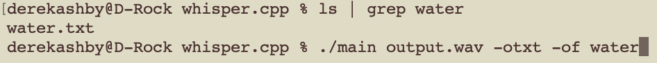

# CS260 course notes (CAN USE ON MIDTERM AND FINAL)

## GitHub Assignment
- I learned how to create and manage a git repository on my machine.
- I also learned how to store that repository on GitHub.
- Finally, I learned how to resolve merge conflicts between local and cloud repositories.

## 1/19/24
- [whisper.wasm](https://github.com/ggerganov/whisper.cpp/tree/master/examples/whisper.wasm)
- [whisper.cpp](https://github.com/ggerganov/whisper.cpp)
### whisper.cpp usage:

## 1/23/24
- learned how to create an AWS EC2 instance
  - public IP http://3.228.72.115
  - ssh -i /Users/derekashby/Documents/starlord-banana-landscaping.pem ubuntu@54.85.249.244

## 1/24/24
- created and set up AWS Route 53 DNS server
  - learned how to connect an IP address to a DNS domain through Route 53
  - "The additional NS and SOA type records that were listed for your domain name are important for working with DNS. These records were created automatically for you when you registered your domain name. The name server (NS) record contains the names of the authoritative name servers that authorize you to place DNS records in this DNS server. Those same authoritative name servers are listed with the registrar that you leased your domain name from. That way the authoritative name server can verify that the DNS records and the DNS registration match and are authorized to represent the domain name when defining DNS records. Otherwise a hacker could just add DNS records and take over your domain name."
  - "This wildcard represents that any subdomain will match this record"